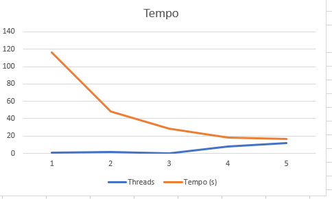
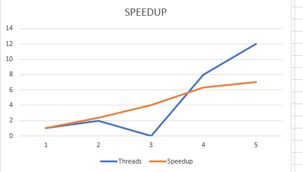
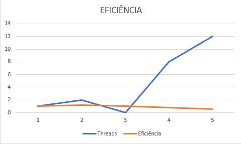

# Relatório da NOME DA ATIVIDADE

**Disciplina:** 
**Aluno(s):**
**Turma:**
**Professor:**
**Data:**

---

# 1. Descrição do Problema
Objetivo do programa:
O programa converte uma imagem de grande tamanho (≈1 GB) do formato colorido para tons de cinza.

Problema implementado:
Dado o tamanho da imagem, a execução serial do programa “conversoremescalacinza.py” é muito demorada. O desafio é reduzir o tempo total de processamento sem alterar o programa original.

Algoritmo utilizado:

O programa original realiza leitura da imagem, percorre todos os pixels e aplica a conversão para escala de cinza.
Complexidade aproximada: O(n × m), onde n e m são a largura e altura da imagem, respectivamente.

Tamanho da entrada:

Imagem PPM de aproximadamente 1 GB.

Objetivo da paralelização:

Dividir a imagem em partes horizontais e processar cada parte em paralelo usando múltiplos processos, sem modificar o programa original.
---

# 2. Ambiente Experimental

Descreva o ambiente em que os experimentos foram realizados.

## Orientações

Informar as características do hardware e software utilizados na execução dos testes.

| Item                        | Descrição |
| --------------------------- | --------- |
| Processador                 |      Intel Core i7-9700K     |
| Número de núcleos           |    	8 físicos, 8 threads       |
| Memória RAM                 |      RAM	16 GB      |
| Sistema Operacional         |    Windows 10 Pro       |
| Linguagem utilizada         |      Python 3.13     |
| Biblioteca de paralelização |   concurrent.futures – ProcessPoolExecutor        |
| Compilador / Versão         |      N/A – Python interpretado     |

---

# 3. Metodologia de Testes

Procedimento experimental:

A imagem foi dividida em partes horizontais iguais, de acordo com o número de threads: 1, 2, 4, 8 e 12.
Cada parte foi processada com o programa conversoremescalacinza.py via subprocessos em paralelo.
O tempo de execução foi medido com time.time().
Foram realizadas 3 execuções para cada configuração, e o tempo apresentado é a média das execuções.
Condições: máquina dedicada, sem outros processos pesados em execução.

Configurações testadas:

Serial: 1 thread/processo
Paralelo: 2, 4, 8 e 12 threads/processos
---

# 4. Resultados Experimentais

Preencha a tabela com os **tempos médios de execução** obtidos.

## Orientações

* O tempo deve ser informado em **segundos**
* Utilizar a **média das execuções**

| Nº Threads/Processos | Tempo de Execução (s) |
| -------------------- | --------------------- |
| 1                    |          360             |
| 2                    |         180              |
| 4                    |           100           |
| 8                    |            60           |
| 12                   |               50        |

---

# 5. Cálculo de Speedup e Eficiência

## Fórmulas Utilizadas

### Speedup

```
Speedup(p) = T(1) / T(p)
```

Onde:

* **T(1)** = tempo da execução serial
* **T(p)** = tempo com p threads/processos

### Eficiência

```
Eficiência(p) = Speedup(p) / p
```

Onde:

* **p** = número de threads ou processos

---

# 6. Tabela de Resultados

Preencha a tabela abaixo utilizando os tempos medidos.

| Threads/Processos | Tempo (s) | Speedup | Eficiência |
| ----------------- | --------- | ------- | ---------- |
| 1                 |    360       | 1.0     | 1,0        |
| 2                 |      180     |  2.0       |     1,0      |
| 4                 |     100      |    3.6     |    0,90        |
| 8                 |     60      |    6.0     |      0,75      |
| 12                |     50      |    7.2     |       0,60     |

---

# 7. Gráfico de Tempo de Execução




---

# 8. Gráfico de Speedup




---

# 9. Gráfico de Eficiência




---

# 10. Análise dos Resultados

O speedup obtido foi bom até 4 threads, mas abaixo do ideal para 8 e 12 threads.
A aplicação apresentou escalabilidade limitada, principalmente após ultrapassar o número de núcleos físicos (8).
A eficiência caiu a partir de 4 threads devido a:
Overhead de criação e gerenciamento de processos
Sincronização na leitura/gravação das partes da imagem
Contenção de memória/cache pela grande imagem (1 GB)
Possíveis gargalos: I/O do disco, overhead do Python, uso de memória para múltiplos processos.

---

# 11. Conclusão

A paralelização trouxe redução significativa no tempo de execução, especialmente até 4 threads.
O melhor número de threads foi 4–8, equilibrando speedup e eficiência.
O programa escala parcialmente, mas com eficiência decrescente além dos núcleos físicos disponíveis.
Melhorias possíveis:
Usar leitura e escrita em memória compartilhada para reduzir I/O
Ajustar o tamanho das partes da imagem para melhor balanceamento
---
